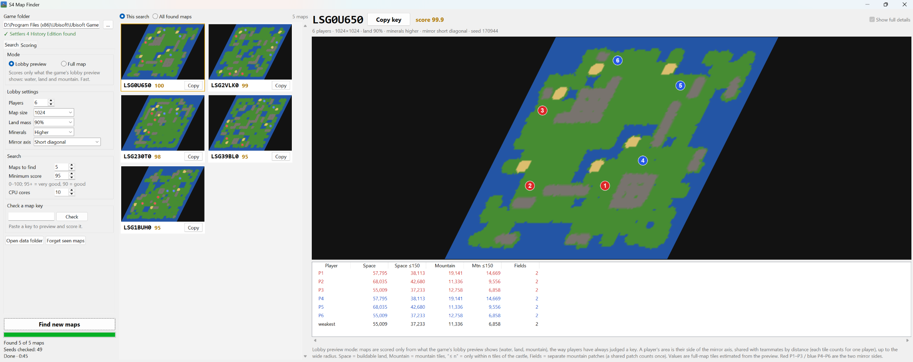
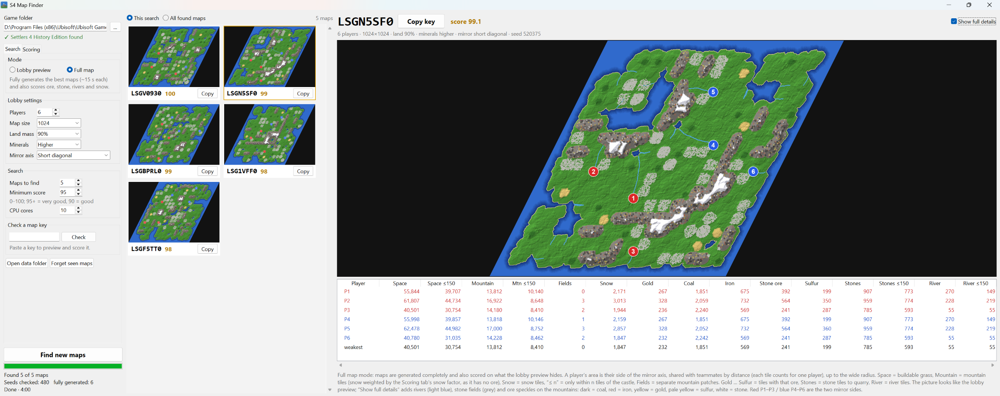

# S4 Map Finder

**Finds fair, well-balanced random maps for The Settlers 4 (History Edition).**

In the Settlers 4 lobby, a random map is set by a short key such as `LSGUKDC0`. Most random maps are uneven: one
player gets little mountain, or is boxed in by water. Finding a good one by hand means loading map after map.
S4 Map Finder checks thousands of keys for you and keeps the maps where **every** player has enough mountain
(the most important thing) and enough building space. You browse pictures of the best maps and copy a key straight
into the lobby.

It has two modes:

- **Lobby preview:** judges a key only by what the game's lobby preview shows (water, land and mountain), the way
  players have picked keys for years. Snow on the big mountains is estimated from their size. Fast.
- **Full map:** generates the whole map and also scores what the preview hides: ore (gold, coal, iron, stone,
  sulfur), stone fields to quarry, rivers, and snow on the mountains. It also shows and counts the forests.

**How it does it.** The tool runs the game's own random-map generator, taken from your installed `S4_Main.exe` and
run in an emulator (Unicorn). So the map you see for a key is exactly the map the lobby will make for it. Each key
gets a quick check from the small lobby preview first. In full map mode, only the most promising ones are then
fully generated, measured for every player, and scored. A map is only as good as its **weakest** player, so the score is built from what the
weakest player gets.

**Lobby preview mode:** maps judged by what the lobby preview shows.



**Full map mode** with *Show full details* on: the whole generated map with rivers, stone fields and ore, and stats
for every resource.



 

---

## Download

Download **`S4MapFinder.exe`** from the [latest release](../../releases/latest). It is a single file with no install
needed; just run it.

Requirements:

- Windows 10 or 11 (64-bit).
- **The Settlers 4: History Edition installed** (Ubisoft Connect). The tool uses the generator inside your game's
  `S4_Main.exe`; no game files are included in the download.
- Any modern CPU. More cores make searching faster: 20 very good maps take about 5 minutes on 15 cores.

> Windows SmartScreen may warn about the exe because it isn't code-signed. Click **More info → Run anyway**.

## Quick start

1. Start `S4MapFinder.exe`. The top left should say **✓ Settlers 4 History Edition found**. If it doesn't, set the
   game folder (see [below](#game-folder)).
2. On the **Search** tab, pick a [mode](#mode) and set the lobby settings you play with (players, map size, land
   mass, minerals, mirror axis).
3. Click **Find new maps**. Maps appear in the middle list as they're found.
4. Click a map to see a large preview and the stats for each player.
5. Click **Copy key** (or **Copy** on a card) and paste the key into the random-map key field in the game lobby.
   Use the same lobby settings in the game as in the tool; they are part of the key.

## Game folder

The tool needs the folder that contains **`S4_Main.exe`** of the History Edition, for example

```
C:\Program Files (x86)\Ubisoft\Ubisoft Game Launcher\games\thesettlers4
```

- **Automatic:** on start it looks in the Ubisoft Connect install folder (from the registry) and the usual install
  paths on `C:` and `D:`.
- **Manual:** if the line below the folder says ✗, click **…** next to the folder box and pick the folder that holds
  `S4_Main.exe`. In Ubisoft Connect you can find it via the game's page → *Properties* → *Open folder*. The folder is
  remembered.
- **Version check:** the tool only works with the History Edition build it was made for, and checks the exe's
  fingerprint. If Ubisoft updates the game and the generator changes, you'll see *Unsupported S4_Main.exe version*.

## Search tab

### Mode

| Mode | What it uses | Speed |
| --- | --- | --- |
| **Lobby preview** | Only what the lobby preview shows: water, land and mountain. Nothing about ore, stone or rivers. Mountain and space are estimated from the 160×160 preview. The preview shows no snow, so snow is estimated from how deep inside a mountain the ground is: big mountains have snow on top. | Fast: hundreds of keys per minute. |
| **Full map** | Everything from lobby preview mode, plus what the preview hides: ore, stone fields and rivers, and the real snow, measured tile by tile on the fully generated map. | Each map takes about 15 s to generate; only the best keys from the quick check are generated. |

Each mode keeps its own list of found maps. Switch the mode before you start a search; it can't change while a
search runs. The Scoring tab greys out the lines a mode doesn't use.

### Lobby settings

These must match the settings you will choose in the game lobby. Results are kept separately for every combination.

| Setting | What it does |
| --- | --- |
| **Players** | Number of players on the map (2–8). For 3 vs 3, use 6. P1–P3 and P4–P6 are the two teams. |
| **Map size** | Map width and height in tiles (256–1024). |
| **Land mass** | How much of the map is land rather than water (10–90 %). |
| **Minerals** | Amount of ore in the mountains: Lower, Normal or Higher. |
| **Mirror axis** | How the map is mirrored between the teams. *Short diagonal* is the usual 3v3 setting. With a single mirror axis (short or long diagonal), each team gets its own half of the map. With *None* or *Short and long diagonals*, land is split by nearest castle instead. |

### Search

| Setting | What it does |
| --- | --- |
| **Maps to find** | How many new maps the search should find before it stops. |
| **Minimum score** | Only maps with at least this score (0–100) are shown. 95+ is very good, 90 is good. A higher minimum means a longer search. |
| **CPU cores** | How many processor cores the search uses. The default leaves one core free so the PC stays usable. |

**Find new maps** starts a search; the same button becomes **Stop**, which you can press at any time. Below it you see
how many maps are found, how many keys were checked (and, in full map mode, fully generated), and the elapsed time.

A search never shows you a map twice: maps you've been shown are remembered, so every run brings new keys. Good maps
found in earlier runs that you haven't seen yet are shown first, instantly.

## Results

- **This search / All found maps** (above the list): *This search* lists the maps from the current run. *All found
  maps* lists every map found so far for the current lobby settings, best first, including ones you've seen.
- **Map cards:** preview, key and score. Click a card to show it on the right; **Copy** copies its key.
- **Red ✕** (top left of a card): dismisses a map you don't like. It disappears from the list for good, in both
  modes, and is never offered again; **Undo dismiss** below the list brings back the last ones dismissed.
- **Copy all keys** (below the list): copies the keys of all listed maps, one per line.
- **Big picture:** drawn like the in-game minimap: a slanted map, red circles for team 1 (P1–P3) and blue for team 2
  (P4–P6). In lobby preview mode it shows exactly what the lobby preview shows: water, land, mountain (grey) and
  desert. In full map mode it is the whole generated map.
- **Show full details** (top right, full map mode only): off by default, so the full map looks like the lobby
  preview would show it. Turn it on to also see what the preview hides: rivers in light blue, forests in dark
  green, stone fields in grey, and ore speckles on the mountains (dark = coal, red = iron, yellow = gold, pale
  yellow = sulfur, white = stone). Maps found before forests were drawn show them only once checked again.
  It switches the big picture and the thumbnails.
- **Show radii** (top right, both modes): faint circles around every castle for the Scoring tab's wide radius
  (lighter shade) and close radius (darker shade), red for team 1 and blue for team 2. They show what the player areas
  can take in at most: distances are walked over land, so water makes the real area smaller.
- **Stats table**, one row per player plus a *weakest* row (the lowest value of each column). Lobby preview mode
  shows the first six columns; full map mode shows all of them (scroll sideways if the window is narrow):

  | Column | Meaning |
  | --- | --- |
  | Space | Buildable land in the player's area, in [blocks](#mountain-blocks) (in full map mode: grass flat enough to build on) |
  | Space ≤3 | Buildable land within the close radius of the castle, in blocks |
  | Mountain | Mountain in the player's area, in [blocks](#mountain-blocks) ("4.5 bl"); snow counts at the Scoring tab's snow factor (0 by default: not at all) |
  | Mtn ≤3 | The same, within the close radius of the castle |
  | Fields | Separate mountain patches the player has (a patch shared by teammates counts once) |
  | Snow | Snow in the player's area, in blocks (no ore under snow); estimated in lobby preview mode |
  | Gold, Coal, Iron, Stone ore, Sulfur | Tiles with that ore in the player's area |
  | Stones, Stones ≤3 | Stone tiles to quarry (stone fields on the grass), in the area / within the close radius |
  | Trees, Trees ≤3 | Trees to cut, in the area / within the close radius (maps found before trees were counted show –) |
  | River, River ≤3 | River tiles, in the area / within the close radius |
  | Start stone, Start forest | ✓ if the player has a stone field / forest of their own next to the castle (see [Own start fields](#own-start-fields)); – = found before this was checked |

  In lobby preview mode the values are full-map tiles estimated from the small preview, so they are rougher.

  "The player's area" is explained under [Player areas](#player-areas). The ≤ number follows the close radius on the
  Scoring tab.

Other buttons on the left:

- **Check a map key:** type or paste any key (8 characters, ending in 0) and press **Check**. It is scored in the
  current mode and shown, which is handy for a key a friend sent you: from its lobby preview in a few seconds, or
  fully generated in about 15 s. The key's own lobby settings are used.
- **Open data folder:** opens where the results of the current settings are stored.
- **Why maps were rejected** (under the search status): for the maps that scored below the minimum, how often each
  score line missed points, and how often it was the *only* thing in the way (full points on that line would have
  been enough). For example, "Mountain: missed points 100 % · only reason 0.5 %" means every rejected map lost some
  mountain points, but only 1 in 200 would have made it with full mountain points. The line with the highest second
  number is the one to loosen first to find maps faster. In full map mode it also shows how many maps were dropped
  for a missing own start field. The lines most in the way are shown in **red**, those also often in the way in
  **orange**, and the Scoring tab colours its score lines the same way. Until some line has been the only thing in
  the way, the colours go by the points each line cost.
- **Forget seen maps:** makes maps you've already been shown for these settings eligible to be shown again.

## Scoring tab

This tab sets what counts as a good map. The score is 0–100. Each **score line** looks at the **weakest player** for
one thing (for example mountain) and gives full points if that player reaches the line's **target**. The lines are
then combined using their **weights**.

Changing a target or weight re-scores all found maps immediately, so you can sort your maps by what matters to you.
Changes also steer the next search: its quick check of each key uses the lobby preview lines.
**Reset to defaults** restores the values below. They are strict: on 3,000 random maps (6 players, 1024, land
90 %, lobby preview score) about 1 in 750 scores 95 or more, 1 in 250 scores 90 or more and 1 in 33 scores 80 or
more, so a search for 95+ maps takes a while.

### Player areas

| Setting | Default | What it does |
| --- | --- | --- |
| **Wide radius** | 4.5 blocks | How far from the castle (in block widths of 56 tiles, so 4.5 = 252 tiles) ground counts for a player: mountain, space, ore, stone fields, trees and river. Everything further away is ignored. |
| **Close radius** | 3 blocks | Used by the "close" lines and the ≤ columns: only the player's own ground within this distance of the castle (ground closer to another player's castle is theirs, see [How it works](#player-areas-1)). Mountain close to home is easier to use and defend. |
| **Snow** | 0 | How much a snow tile counts compared with plain rock, in every mountain line (Mountain, Mountain close, Mountain fairness). Big mountains have snow on top, and there is never ore under snow, so snow is worth less. 0 = snow doesn't count at all; 0.5 = a snow tile counts half; 1 = snow counts like rock. It works per tile, not per block: only the snow itself is left out, the rest of the mountain counts in full. In full map mode the snow tiles are exact; in lobby preview mode the snow is estimated (per preview pixel, ≈6×6 tiles), as the preview doesn't show it. Lower values punish snowy mountains more. Fields ignore snow whatever this is set to. |

Distances are walking distances over land, not straight lines, so water in between makes ground count as further
away.

The snow factor re-scores maps instantly like a target or weight. Changing a radius changes the measurements themselves, so maps have to be generated again: a new search starts its
own list. Maps found with each radius setting are kept separately, and switching back brings the old list back.
Maps found while the radii were set in tiles (200 or 250 wide, 150 close) are kept on disk but no longer shown, as no block setting matches them exactly.

### Score lines

The first six lines use what the lobby preview shows and count in both modes. The others count in full map mode
only.

| Line | Default target | Default weight | What it measures |
| --- | --- | --- | --- |
| **Mountain** | 5.5 blocks | 30 | Mountain within the wide radius of the weakest player's castle, in [blocks](#mountain-blocks). Mountain is where mines go, so this matters most. |
| **Mountain, close** | 3.5 blocks | 20 | Mountain within the close radius of the weakest player's castle. Mountain close to home is easier to use and defend. |
| **Space** | 18 blocks | 10 | Buildable land in the weakest player's area. |
| **Space, close** | 15 blocks | 10 | Buildable land within the close radius. |
| **Mountain fairness** | 0.7 | 15 | Weakest player's mountain ÷ strongest player's mountain. 0.7 means full points if the weakest player has at least 70 % of what the strongest has. |
| **Space fairness** | 0.7 | 15 | The same for building space. |
| **Gold** | 150 tiles | 6 | *Full map.* Gold tiles in the weakest player's area. Gold counts most of the ores by default. |
| **Coal** | 800 tiles | 5 | *Full map.* Coal tiles. |
| **Iron** | 300 tiles | 3 | *Full map.* Iron tiles. |
| **Stone ore** | 200 tiles | 3 | *Full map.* Stone ore in the mountains (for stone mines). |
| **Sulfur** | 100 tiles | 1 | *Full map.* Sulfur tiles. |
| **Stone fields** | 400 tiles | 5 | *Full map.* Stone on the grass for stonecutters, in the weakest player's area. More stone is better. |
| **Stone fields, close** | 250 tiles | 5 | *Full map.* The same, within the close radius. |
| **River** | 100 tiles | 3 | *Full map.* River tiles in the weakest player's area (rivers aren't in the lobby preview). |
| **River, close** | 60 tiles | 2 | *Full map.* River tiles within the close radius. |

The default ore, stone and river targets are about what the weakest player gets on a good map (measured on 120
random maps).

#### Own start fields

The generator puts a stone field and a forest right next to every castle (10–30 tiles away). On some maps one
is missing, or two teammates' castles are so close that they'd have to share one. With **Every player needs
their own start stone field and forest** on (the default, full map mode only), such maps score 0: every player
needs a stone field and a forest within 35 tiles of the castle that no other player needs too (a field big
enough for two counts twice). About half of all random maps fail this, mostly through a missing stone field.

- **Target:** the amount the weakest player needs for full points on that line. Below the target, points drop in
  proportion (half the target gives half the points); above it there is no bonus.
- **Weight:** how much the line counts. Weights are relative: the score is the weighted average of the lines,
  so 30/30 is the same as 1/1. A weight of 0 turns the line off.
- **Mountain keeps its share in full map mode.** Mountain matters most, so the three mountain lines (Mountain,
  Mountain close, Mountain fairness) make up the same share of the score in both modes: 65 % with the defaults.
  In full map mode, space and the full-map-only lines (ore, stone fields, river) split the remaining 35 % by their
  weights. So the extra lines take their points from space, never from mountain; with the defaults, space gets
  18 %, ore 9 %, stone fields 5 % and river 3 %.
- **Scaling:** targets are meant for 1024×1024 with 6 players. For other settings they are scaled by the land
  available per player (a 512 map has a quarter of the area; 4 players get 1.5× as much each), so you don't need to
  change them when you switch settings.

Examples:

- *I want lots of mountain near my castle:* raise the **Mountain, close** weight to 30.
- *Searches take too long:* loosen the line shown in red under the search status (for example **Mountain, close**
  to 3 blocks).
- *Gold matters even more for my games:* raise the **Gold** weight to 10–15.
- *Ore doesn't matter, only the layout:* use lobby preview mode, or set the ore weights to 0.
- *I only care that it's fair:* raise both fairness weights and lower the others.

### Mountain blocks

The generator lays the map out on a grid of square blocks, 56×56 tiles each: the squares you see in the lobby
preview. Mountain and space are counted in blocks, the way players talk about a map: one mountain block on its own
is a small mountain, two side by side a bar, and 2×2 a big square. A block of land is 3,136 tiles; a mountain block
holds about 2,800 mountain tiles (its foot included), as a mountain doesn't fill its block completely. The default
target of 5.5 blocks means the weakest player needs about five and a half blocks' worth of mountain (snow not
counted) within 4.5 blocks. A *field* in the stats table is a separate mountain, of any number of blocks.

## How it works

1. **Quick check** (well under 1 s per key per core). The tool runs the generator's first step and the 160×160
   lobby preview, splits the land between the players, and estimates mountain, snow and space for each in full-map
   tiles. This is the lobby preview score. In **lobby preview mode** this is the map's score, and keys at or above
   the minimum score are shown right away.
2. **Full generation** (full map mode; about 15 s per map, many in parallel) for the top 3 % of keys by quick check.
   The full 1024×1024 map is generated, every player's area is measured tile by tile (mountain, snow, ore, stone,
   rivers), and the map is scored and drawn.
3. Maps at or above the minimum score are shown. The search keeps checking fresh keys until it has found as many as
   you asked for.

The lobby preview score ranks maps almost the same way as the full map score (rank correlation 0.97 on 120 random
maps), but it can't see ore, stone, rivers or snow, and the preview is a slightly simplified map.

### Player areas

On a mirrored map the mirror axis is the front line: enemies can't build on your half. Each team gets its side of the
axis, and within it every tile goes to the **nearest teammate** (walking over land). A mountain between two teammates
is split between them, and **no tile counts for two players**. The radii are applied after this split: a player's
wide and close lines only count their own tiles. A mountain inside your close radius that is even closer to a
teammate's castle is the teammate's, so it counts for neither your close nor your wide mountain; the other way
round, your close mountain can't count for anyone else's wide mountain. (Your close mountain is part of your own
wide mountain, as the close circle lies inside the wide one.) A mountain patch counts as a *field* for the teammate
who holds most of it, and for a second teammate only if they hold at least 40 % of it. Only mineable mountain (not
snow) counts toward the size of a field. On maps without a single mirror axis, every tile goes to the nearest castle.

### Mountain terrain

Ore is only ever found on plain rock. A mountain goes from its foot (next to the grass) over rock up to a snow edge
and snow on the highest parts; the foot, the snow edge and the snow never have ore. The tool counts the snow edge and
snow as *snow*.

### Calibration

Known-good league keys (6 players, 1024, land 90 %, minerals higher, short diagonal) with the default score:

| Key | Full map | Lobby preview | Weakest player's mountain (snow not counted) |
| --- | --- | --- | --- |
| LSGUKDC0 | 91 | 86 | 4.5 blocks |
| LSG5JJE0 | 81 | 80 | 3.5 blocks |
| LSGFG8O0 | 72 | 61 | 3.7 blocks |
| LSG2NBQ0 | 69 | 64 | 2.9 blocks |
| LSGKKUJ0 | 73 | 56 | 3.4 blocks |
| LSG2H840 | 55 (P2/P5 are short on mountain) | 43 | 2.6 blocks |


## Where data is stored

Everything is in `%LOCALAPPDATA%\S4MapFinder`:

- `config.json`: your settings, including the game folder and scoring parameters.
- `maps\<players>p_<size>_land<land>_min<minerals>_mirror<mirror>\`: one folder per lobby setting combination, with
  the found maps (`deep*.json` for full map mode, `preview*.json` for lobby preview mode), checked keys
  (`scan*.json`), the maps you've been shown (`shown.json`, `shown_preview.json`), and the pictures (`img\`).

Delete the folder to start completely fresh.

## Troubleshooting

| Problem | What to do |
| --- | --- |
| ✗ *S4_Main.exe not found in this folder* | Pick the game folder with **…** (see [Game folder](#game-folder)). |
| ✗ *Unsupported S4_Main.exe version* | Your game build differs from the one this tool supports. |
| The search finds maps slowly | Lower the minimum score, use more CPU cores, or relax the Scoring targets. |
| Something seems broken | Run `S4MapFinder.exe --selftest` from a command prompt. It runs a short search in both modes and writes `%LOCALAPPDATA%\S4MapFinder\selftest.log`. |

---

## For developers

### Run from source

```
pip install -r requirements.txt
python app.py
```

Python 3.11+ on Windows. The game must be installed; set `S4_EXE` to point at a specific `S4_Main.exe`.

### Build the exe

```
pip install pyinstaller
python build.py          # -> dist\S4MapFinder.exe
```

Don't run PyInstaller directly: its launcher is built with Control Flow Guard, which crashes Unicorn's JIT, and
`build.py` clears that flag after building.

### Command line

There is also a command-line version that writes an HTML gallery:

```
python mapfinder.py                       # 6 players, 1024, land 90 %, minerals higher, short-diagonal mirror
python mapfinder.py --scan 10000 --maps 15
python mapfinder.py --keys LSGUKDC0 LSG2H840   # just score and render these keys
python mapfinder.py --mirror 0 --land 80   # other lobby settings
```

Open `results/index.html` to see the results and click a key to copy it. Every run scans new keys and only shows maps
you haven't been shown before (`--reshow` ranks everything again). The command line uses the default score
parameters.

### Files

| File | Purpose |
| --- | --- |
| `app.py` | Desktop UI (Tkinter). |
| `engine.py` | Search engine used by the UI: worker pool, lobby preview and full map search, result storage. |
| `analyze.py` | Player areas, metrics, scoring, and rendering. |
| `s4gen.py` | Unicorn emulator for the generator. It stubs the CRT/Win32 functions the generator uses. |
| `s4key.py` | Map key ↔ settings (base32, least-significant character first: players, minerals, size, mirror, land, 20-bit seed). |
| `mapfinder.py` | Command-line version. |
| `s4map.py` | Reads saved `.map` files using the game's own decrypt and decompress routines. |
| `validate.py` | Compares emulated output with real `Map\User\UnitedLeague_*.map` saves. Terrain matches about 88–90 % per byte: mountains, lakes and land outline are identical, and only coast and transition texturing differ. |
| `build.py` | Builds the exe. |

Generator entry points (HE exe, md5 `153c49ab29946c21d50a3ae7a95c5cf8`):

| Address | Function |
| --- | --- |
| `0x50ADA0` | Key decoder |
| `0x50A4D0` | Host |
| `0x68C640` | Init |
| `0x68CAF0` | Preview |
| `0x68D8C0` | Generate |

The RNG is an LCG: `s = s*0x6C078965 + 1`, output `s >> 16`.

*Not affiliated with Ubisoft or Blue Byte. The Settlers is a trademark of Ubisoft Entertainment.*
